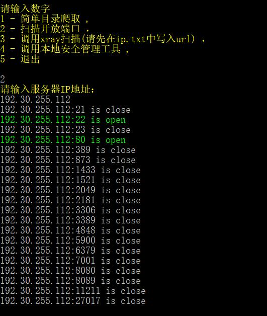

# ChoScan

基于原wgdscan的改进工具
在原版作者的基础上进行了纠错，未来还会新增其他功能

效果预览：





已存在功能：

```
1.爬取目标网站所有子网站
2.网页的简单sql检测
3.检测服务器开启的端口
```

预计新增功能：

```
1.查询开放端口（√）
2.扫描敏感目录（√）
3.生成字典爆破
4.图形界面
5.爬取图片
```

## 更新记录

2020.10.7 优化了功能的选择，每次能选择需要的功能来运行

2021.04.6 集成Xray，加入了Python调用Xray扫描的命令

2021.04.20 优化了端口扫描效率以及扫描显示的结果